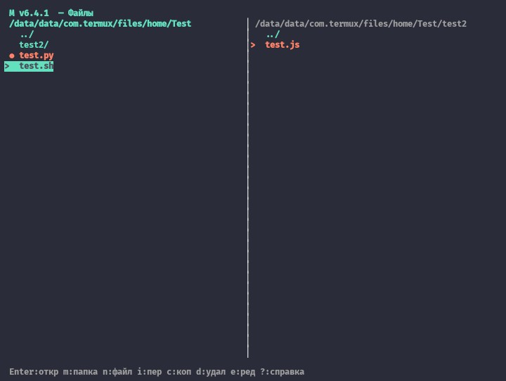
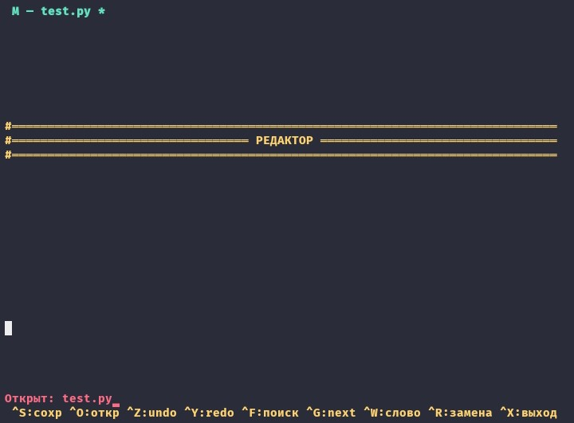

# M — универсальный инструмент для Termux

> Двухпанельный файловый менеджер + редактор + куча утилит «всё в одном».
> Только стандартная библиотека Python. Mobile-first.


---

## Скриншоты

<p align="center">
  <a href="docs/files.jpg"></a>
  &nbsp;
  <a href="docs/editor.jpg"></a>
</p>

<p align="center">
  <em>Снаружи - двухпанельный файловый менеджер, внутри - текстовый редактор</em>
</p>

---

## Что это

`M` — один файл `m.py`, который даёт:

- 🗂 **Двухпанельный файловый менеджер** с вкладками, закладками, скрытыми файлами
- ✏️ **Встроенный редактор** с undo/redo, поиском, заменой, подсветкой через хуки
- ↩️ **Undo/Redo** для всех файловых операций (создание, копирование, перемещение, переименование, удаление)
- 🗑 **Корзину** с восстановлением на исходный путь
- 📦 **Просмотр и распаковку** zip/tar архивов (с защитой от path traversal и symlink-атак)
- 📊 **Дашборд** системы (батарея, память, диск, температура, Wi-Fi IP)
- 🎨 **Подсветку файлов** по расширению
- 🔌 **Систему хуков** для расширения без правки основного кода
- 🖱 **Мышь**: клик, двойной клик, колесо
- 🌏 **Корректный Unicode**: широкие символы и комбинирующие метки

Работает в Termux, Linux, macOS, WSL. Никаких зависимостей — только Python 3.8+.

---

## Установка

### Termux (Android)

```bash
pkg update && pkg install python git
git clone https://github.com/ShiMukanshin/m-termux.git
cd m-termux
chmod +x m.py
./m.py
```

Опционально — установить как команду `M`:

```bash
mkdir -p ~/bin
ln -sf "$PWD/m.py" ~/bin/M
chmod +x ~/bin/M

# если ~/bin ещё не в PATH:
echo 'export PATH="$HOME/bin:$PATH"' >> ~/.bashrc
source ~/.bashrc
```

После этого `M` запускается из любого места.

### Linux / macOS / WSL

```bash
git clone https://github.com/ShiMukanshin/m-termux.git
cd m-termux
chmod +x m.py
sudo ln -sf "$PWD/m.py" /usr/local/bin/M
```

---

## Использование

### Командная строка

```
M                запустить файловый менеджер
M -e [FILE]      редактор (FILE — необязательно)
M -m NAME        создать папку
M -i SRC DST     переместить файл/папку
M -c SRC DST     скопировать файл/папку
M -h, --help     справка
M -v, --version  версия
```

### Горячие клавиши — файловый менеджер

| Клавиша | Действие |
|---|---|
| `Tab` | переключить панель |
| `j` / `k` / ↑ / ↓ | навигация |
| `Enter` | войти в папку / открыть файл |
| `m` / `n` | новая папка / новый файл |
| `i` / `c` | переместить / копировать в другую панель |
| `r` / `d` | переименовать / удалить в корзину |
| `Space` | отметить файл (для групповых операций) |
| `e` | открыть в редакторе |
| `u` / `U` | undo / redo файловых операций |
| `/` `n` `N` | поиск / следующее / предыдущее |
| `Esc` | сбросить поиск |
| `.` | показать/скрыть скрытые файлы |
| `b` / `B` | добавить закладку / список закладок |
| `R` | корзина |
| `t` / `T` | новая / закрыть вкладку |
| `1`..`9` | переключить вкладку |
| `D` | дашборд системы |
| `x` | менеджер хуков |
| `?` | справка |
| `q` | выход |

### Горячие клавиши — редактор

| Клавиша | Действие |
|---|---|
| `Ctrl+S` | сохранить (создаёт файл, если его нет) |
| `Ctrl+O` | открыть другой файл |
| `Ctrl+X` | выйти (спросит про несохранённое) |
| `Ctrl+Z` / `Ctrl+Y` | undo / redo |
| `Ctrl+F` / `Ctrl+G` | поиск / следующее совпадение |
| `Ctrl+W` | искать слово под курсором |
| `Ctrl+R` | замена (`старый\|новый`) |
| `F1` или `Ctrl+P` | справка редактора |
| `Tab` | отступ (4 пробела или `\t` для `.go`, `.c`, `.h`, `.cpp`) |

Undo в редакторе **группирует непрерывный ввод**: быстрый поток символов
отменяется одним `Ctrl+Z`, а стрелки, клик мышью и скролл разрывают группу.

### Мышь

- **Клик** — выбрать файл / панель / позицию курсора.
- **Двойной клик** — открыть файл или войти в папку.
- **Колесо** — в файлах двигает выделение, в редакторе — **курсор**
  (вью следует за ним; так курсор не «теряется» при скролле на телефоне).

---

## Хуки

Скрипты в `~/.m/hooks/*.py` подхватываются автоматически. Каждый файл
определяет словарь `EVENTS = {имя_события: функция}`.

### События

| Событие | Аргументы | Когда |
|---|---|---|
| `on_start` | `cwd` | запуск M |
| `on_open` | `path`, `kind` | открытие файла/папки/архива |
| `on_file_change` | `path` | файл загружен в редактор |
| `on_save` | `path` | сохранение из редактора |
| `on_create` | `path`, `kind` | создание файла/папки/копии |
| `on_move` | `src`, `dst` | перемещение или переименование |
| `on_delete` | `path` | удаление в корзину |
| `on_draw_line` | `line`, `lineno`, `filename`, `cursor_line` | **возвращает** список подсветок |

### Пример: подсветка `TODO` в редакторе

```python
# ~/.m/hooks/highlight_todo.py
def draw_line(line, lineno, filename, cursor_line):
    spans = []
    start = line.find("TODO")
    while start != -1:
        spans.append((start, start + 4, 4))  # pair 4 — красный
        start = line.find("TODO", start + 4)
    return spans

EVENTS = {"on_draw_line": draw_line}
```

### Формат подсветки

Кортеж `(start, end, color_pair)`:

- `start` / `end` — индексы символов в строке;
- `end == -1` — залить остаток строки этим цветом (padding);
- `color_pair` — номер пары из `curses.init_pair` (в M доступны 1..10).

### Готовый набор хуков

В репозитории лежит `00_all_hooks.py` — один файл со всем сразу:

- подсветка синтаксиса: Python, Bash, JSON, Markdown, Diff, C/C++/JS/TS/Rust/Go/Java, HTML/CSS, TODO/FIXME;
- логгер операций (`~/.m/logs/actions.log`);
- авто-бэкапы при сохранении (`~/.m/backups/`);
- авто-формат через `black` / `prettier` / `shfmt`, если установлены;
- git-автокоммит в репозитории, в котором лежит файл;
- лог удалений и лог архивов;
- Termux-уведомления при создании объектов;
- шаблоны для новых `.py`, `.sh`, `.md`, `.c`, `.cpp`, `.go`, `.rs`.

Установка:

```bash
mkdir -p ~/.m/hooks
cp 00_all_hooks.py ~/.m/hooks/
ls ~/.m/hooks/     # должен быть ровно один файл
```

Перезагрузить хуки без выхода из M: `x` → `R`.

---

## Данные и конфигурация

Всё лежит в `~/.m/`:

```
~/.m/
├── config.json     # например, show_hidden
├── bookmarks.json  # закладки
├── hooks/          # пользовательские хуки *.py
├── trash/          # корзина + .meta.json
├── logs/           # логи хуков (actions, archives, trash, stats)
└── backups/        # бэкапы файлов при сохранении
```

Настройки сохраняются автоматически при выходе.

---

## Требования

- Python **3.8+**
- Терминал с поддержкой curses (Termux, Linux tty, macOS Terminal, WSL)
- Для Wi-Fi IP в дашборде — `termux-wifi-connectioninfo` (только Termux)

---

## Планы

- [ ] Тесты (pytest) и CI
- [ ] Упаковка в `pip` / `pipx`
- [ ] Поддержка `7z` и `rar` через внешние распаковщики
- [ ] Настраиваемые цвета и раскладка
- [ ] Больше встроенных хуков

---

## Лицензия

MIT — см. файл [LICENSE](LICENSE).

---

## Вклад

PR и issues приветствуются. Если добавляешь фичу — постарайся обойтись
стандартной библиотекой и не ломать mobile-first UX.
